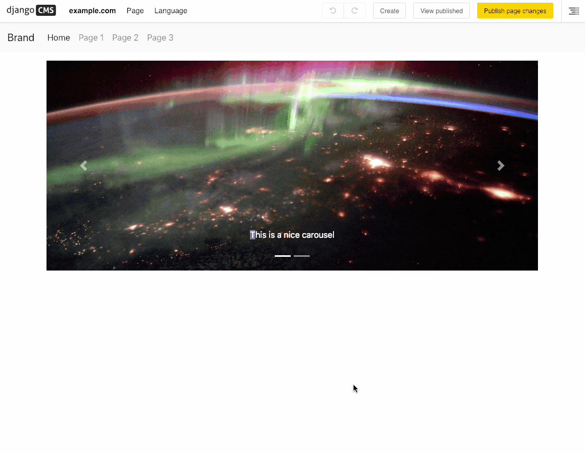

==================
django CMS Modules
==================

|pypi| |build| |coverage|

**django CMS Modules** Adds copy/paste capabilities to groups of plugins.

This addon is compatible with `Divio Cloud <http://divio.com>`_ and is also available on the
`django CMS Marketplace <https://marketplace.django-cms.org/en/addons/browse/djangocms-modules/>`_
for easy installation.

Contributing
============

This is a an open-source project. We'll be delighted to receive your
feedback in the form of issues and pull requests. Before submitting your
pull request, please review our `contribution guidelines
<http://docs.django-cms.org/en/latest/contributing/index.html>`_.

Documentation
=============

See ``REQUIREMENTS`` in the `setup.py <https://github.com/divio/djangocms-modules/blob/master/setup.py>`_
file for additional dependencies:

* Python 2.7, 3.4 or higher
* Django 1.11 or higher

Installation
------------

For a manual install:

* run ``pip install djangocms-modules``
* add ``djangocms_modules`` to your ``INSTALLED_APPS``
* run ``python manage.py migrate djangocms_modules``

Running Tests
-------------

You can run tests by executing::

    virtualenv env
    source env/bin/activate
    pip install -r tests/requirements.txt
    python setup.py test

.. |pypi| image:: https://badge.fury.io/py/djangocms-modules.svg
    :target: http://badge.fury.io/py/djangocms-modules
.. |build| image:: https://travis-ci.org/divio/djangocms-modules.svg?branch=master
    :target: https://travis-ci.org/divio/djangocms-modules
.. |coverage| image:: https://codecov.io/gh/divio/djangocms-modules/branch/master/graph/badge.svg
    :target: https://codecov.io/gh/divio/djangocms-modules
